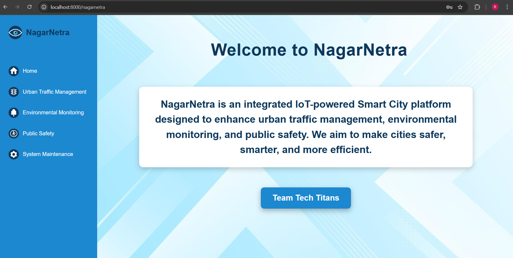
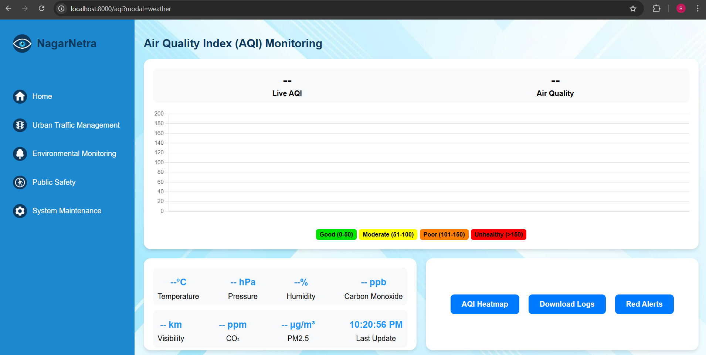
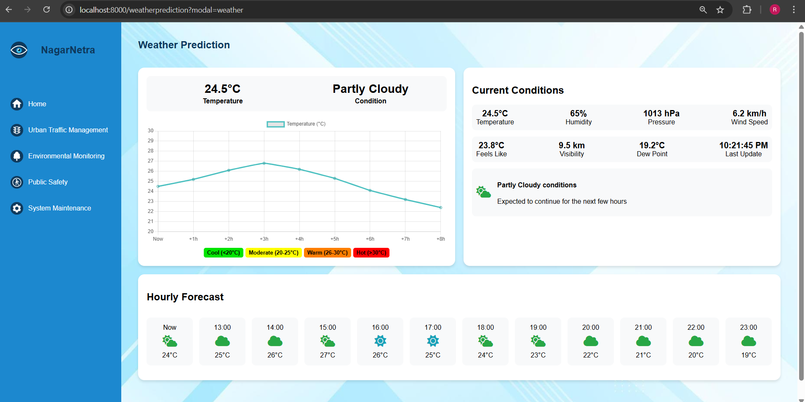
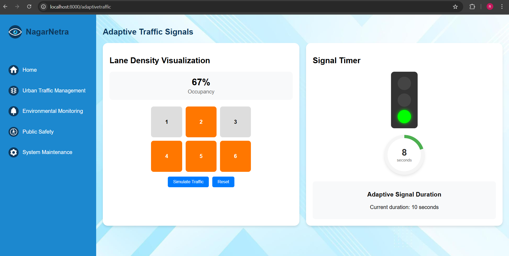
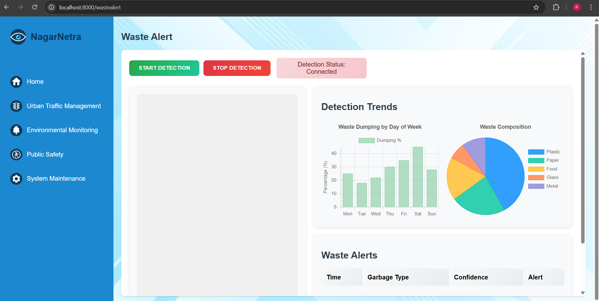

# NagarNetra Smart City IoT Platform
A comprehensive IoT solution for urban management that integrates environmental monitoring, traffic management, and public safety.

## 🚀 Features
✅ **Environmental Monitoring** - AQI tracking, weather prediction, wind & rain data  
✅ **Urban Traffic Management** - Adaptive signals, dynamic lane allocation  
✅ **Public Safety** - Surveillance cameras, AI waste detection  
✅ **Real-time Analytics** - Live dashboard for all city metrics  
✅ **Alert System** - Automated email notifications for environmental hazards  
✅ **Smart Visualization** - Geospatial mapping and data visualization

## 📌 Required Installations and Setup
Install Node.js - https://nodejs.org/  
Install MQTT Broker - https://mosquitto.org/download/  
Install Roboflow Account - https://roboflow.com/

### **Install Required Packages**  
```bash
npm install express path http ws mqtt nodemailer socket.io axios dotenv
```

## 🏃‍♂️ **How to Run the Project**  
1️⃣ **Clone the Repository**  
```bash
git clone https://github.com/RujulPawar/NagarNetra-Smart-City-IoT-Platform.git
cd NagarNetra-Smart-City-IoT-Platform
```

2️⃣ **Set Up Environment Variables**  
- Create a `.env` file based on the example below:  
  ```
  # NagarNetra Platform Environment Variables

  # Server Configuration
  PORT=your_server_port
  WS_PORT=your_websocket_port

  # Authentication (replace with proper auth system in production)
  ADMIN_EMAIL=your_admin_email
  ADMIN_PASSWORD=your_admin_password

  # MQTT Configuration
  MQTT_HOST=your_mqtt_host
  MQTT_PORT=your_mqtt_port
  MQTT_USERNAME=your_mqtt_username
  MQTT_PASSWORD=your_mqtt_password

  # Email Configuration
  EMAIL_USER=your_email_user
  EMAIL_RECIPIENT=your_email_recipient
  EMAIL_APP_PASSWORD=your_email_app_password

  # API Keys
  GOOGLE_MAPS_API_KEY=your_google_maps_api_key
  ROBOFLOW_API_KEY=your_roboflow_api_key
  ROBOFLOW_MODEL=your_roboflow_model

  # Hardware Configuration
  ESP32_URL=your_esp32_url
  ```

3️⃣ **Start the Server**  
```bash
npm start
```

The dashboard will be available at `http://localhost:8000`

## 🛠️ **Hardware Requirements**  
- ESP32 
- BME280 Sensor (Temperature, Humidity, Pressure)
- MQ7 Sensor (Carbon Monoxide)
- PM2.5 Sensor (Particulate Matter)
- Hall Effect Sensors (Traffic, Rain & Wind Data)
- ESP32-CAM Modules (Surveillance)
- Servo Motors (2-axis Camera Control)

## 📊 **Platform Screenshots**

### Dashboard Overview


### Environmental Monitoring



### Traffic Management



### Public Safety


## 🌟 **Key Components**

### ➟ **Environmental Module**
- Real-time AQI monitoring with health recommendations
- Weather forecasting with historical data analysis
- Wind and rainfall measurement
- AI-powered waste detection in public spaces

### ➟ **Traffic Management Module**
- Traffic density calculation using hall effect sensors
- Dynamic lane configuration based on traffic patterns
- Smart parking space monitoring

### ➟ **Public Safety Module**
- Multi-axis camera surveillance system
- Automated alert system

## ⚠️ Project Status
**Note:** This project is currently incomplete and under active development. I plan to implement additional features and complete the documentation when time permits. Feel free to contribute or suggest improvements!

## 📝 **Tech Stack**  
🔹 **Node.js** (Backend)  
🔹 **Express** (Web Framework)  
🔹 **MQTT** (IoT Communication)   
🔹 **Roboflow API** (AI Detection)

## 📜 License  
This project is licensed under the **MIT License** – see the [LICENSE](LICENSE) file for details.
